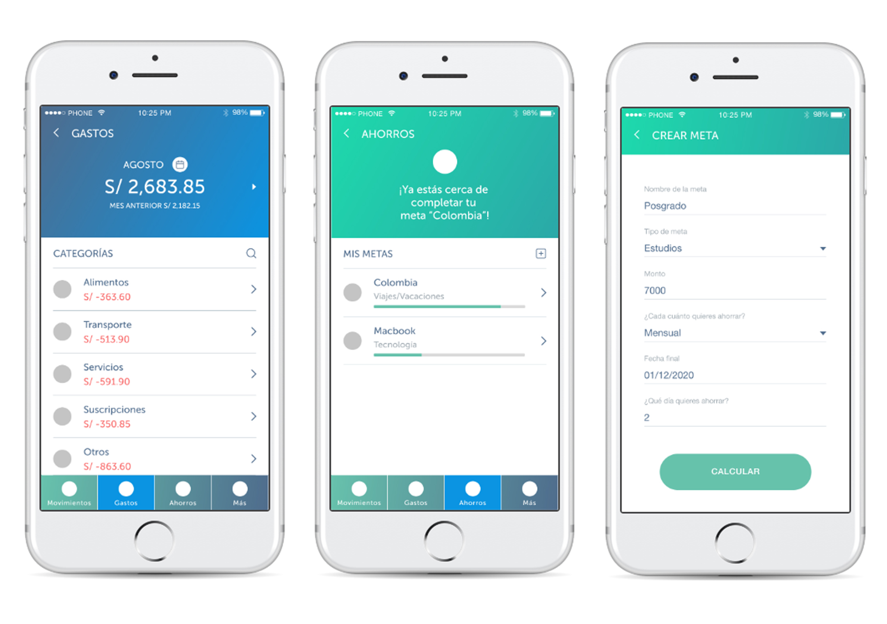

# Aplicación financiera

## Preámbulo

El banco más importante del país ha lanzado una nueva aplicación móvil al
mercado para que sus usuarios puedan visualizar sus gastos mensuales y fomentar
el ahorro. Luego de tener algunos meses en el mercado y algo de tracción, el
equipo detrás de este nuevo producto ha decidido contratar a una
agencia/consultora de UX que los ayude a definir la dirección y evolución del
producto. Tú y otra compañera de Laboratoria trabajan en la agencia/consultora
de UX y son asignadas al proyecto.

## Introducción

### Contexto

Durante la primera semana de entendimiento de los requerimientos, el Product
Manager del equipo les brinda el contexto:

>“Todo empezó hace un año cuando vimos que en EEUU y Europa estaban saliendo
  nuevas aplicaciones financieras que nos llamaron la atención. Unas se enfocan
  en darle visibilidad a sus usuarios sobre los gastos, otras en facilitar pagos
  a terceros y otras a fomentar el ahorro. Inspirados en un par de ellas,
  decidimos lanzar una nueva aplicación. Decidimos que era mejor crear un
  producto desde cero - en lugar de modificar la aplicación actual de banca
  móvil - para poder desarrollarla con un equipo totalmente nuevo, en el
  laboratorio de innovación, bajo prácticas ágiles. Sabemos que no es ideal que
  nuestros usuarios tengan que usar dos aplicaciones, pero desarrollar con un
  equipo nuevo que corra ágil nos da mayor libertad.

> Empezamos entrevistando a algunos usuarios y revisando los resultados de un
  estudio de mercado que nos proporcionó el área de marketing. Eso nos dió una
  idea inicial de qué funcionalidades son más relevantes aquí en nuestro
  mercado. Con base en esos resultados, creamos nuestros primeros user personas
  una primaria y una secundaria ( creemos que estas personas no son las que
  nosotros pensábamos inicialmente), y diseñamos y desarrollamos un ‘Producto
  mínimo viable’ (MVP) en 2 meses en iOS. Ese MVP lo hemos lanzado y tenemos
  alrededor de 6 meses de data. Hoy estamos en el proceso de entender los
  resultados iniciales y de sacar una segunda iteración del producto. Y para eso
  las hemos contratado. Toda la documentación de este producto la tenemos en una
  carpeta de [Google Drive](http://bit.ly/uxd-reto-2). Les doy acceso.
  
> Necesitamos traer una propuesta del nuevo diseño en dos semanas porque tenemos
  que presentarla a nuestro Gerente General en la reunión trimestral. Es
  importante que cualquier cosa que presentemos ya incorpore feedback de testing
  con usuarios. El Gerente General, animado por el crecimiento del número de
  descargas que ha tenido el app, quiere duplicar el presupuesto de Facebook
  Ads… Yo no estoy tan seguro; quisiera que como parte de su trabajo estas
  próximas dos semanas, entendamos ese punto también.”
  
### MVP

### Landing Page

[Link a Landing Page](http://tus-finanzas.pagedemo.co/)

### User Persona

## Presupuesto

|Actividad|Descripción|Puntos|
|:----|:---|:---:|
|Entendimiento del problema, la industria y el contexto| Entender el contexto del negocio y lo que existe hoy en día respecto de la industria del proyecto. | 15 |
|Entrevistas con cliente| Realización de entrevistas con el cliente (dueño del reto) y establecimiento de sus metas y objetivos. | 25 |
|Benchmark| Revisión de features de la competencia y referencias análogas. | 20 |
|Entrevistas con usuarios| Entrevistas en profundidad con al menos 5 usuarios. | 60 | 
|Testeos de prototipos| Sesiones de testing de la solución propuesta (baja, media y alta fidelidad) con al menos 5 usuarios por sesión. | 60 |
|Prototipado de alta fidelidad| Elaboración de prototipo en base a las pantallas diseñadas. | 80 |
| | TOTAL | 260 |

## Investigación

### Entrevista con el Cliente

blablablablablablablablablablablablablablablablablablablablablablablablablablablablablablablablablablablablablablablablablablablablablablablablablablablablablablablablablablablablablablablablablablablablablablablablablablablablablablablablablablablablablablablablablablablablablablablablablablablablablabla.

[Link Entrevista a Cliente](https://drive.google.com/drive/folders/1qJkV0bFj1owrNfxlvtzXR_PCKP-1KNzS?usp=sharing)

### Objetivos

* Validar el user persona entregado.
* Reconocer si el flujo de la aplicación está siendo intuitiva.
* Incentivar el ahorro de sus clientes.
* Validar si se necesita una nueva inversión en redes sociales.

### Problemas Encontrados

Según la data brindada, existían cifras alarmantes:
* El número de descargas de la app era 5 veces más que las personas que lograban crearse una cuenta con al App.
* Al ser una app desarrollada solo para iOS, creaba otro problema por el 75% del mercado peruano utiliza teléfonos celulares con sistemas Android.
* Se demostró que las personas sí llegaban al Landing Page, pero muchas de ellas no lograban concretar la descarga por el sistema operativo de sus celulares.
* El user persona principal no era el idóneo, eso demostraba que la publicidad no habia sido aprovechada al máximo.

### Instalaciones Vs. Sign Ups

### Benchmark

|Característica/Apps|BBVA Manager|Interbank Alcancía|Interbank Smart|Ynab|Wallet|
|:----|:---|:---|:---|:---|:---:|
|Disponible para iOS y Android|SI|SI|SI|SI|SI|
|Descarga Gratuita|SI|SI|SI|SI|SI|
|Asocia Cuenta de Ahorros|SI|SI|SI|SI|SI|
|Asocia más de una Cuenta|SI|SI|NO|SI|SI|
|No necesita asociar cuenta|NO|NO|NO|SI|SI|
|Registra Gastos|SI|NO|SI|SI|SI|
|Historial de Movimientos|SI|NO|SI|SI|SI|
|Permite crear una meta|SI|NO|NO|NO|SI|
|Ingresa con huella digital|NO|SI|SI|NO|NO|
|Ocultar saldo|NO|NO|NO|NO|NO|
|Asesoría|SI|NO|NO|SI|NO|

### Entrevista con Usuarios

blablablablablablablablablablablablablablablablablablablablablablablablablablablablablablablablablablablablablablablablablablablablablablablablablablablablablablablablablablablablablablablablablablablablablablablablablablablablablablablablablablablablablablablablablablablablablablablablablablablablablabla.

[Link Entrevista a Usuarios](https://drive.google.com/drive/folders/1OlBK7gQ-5Jg9BZlOIbEXPqPc0AOyj7_1?usp=sharing)

### Testing Prototipo Inicial

blablablablablablablablablablablablablablablablablablablablablablablablablablablablablablablablablablablablablablablablablablablablablablablablablablablablablablablablablablablablablablablablablablablablablablablablablablablablablablablablablablablablablablablablablablablablablablablablablablablablablabla.

[Link Testing Prototipo Inicial](https://drive.google.com/drive/folders/10aIGXWL9YKRX1bQLsZXdqYkAIF2ZS7kC?usp=sharing)

## Síntesis

### User Persona Propuesto

### Afinity Map

Al finalizar las entrevistas con nuestros usuarios, pudimos destacar los *quotes* más importantes que nos sirvieron para realizar el afinity map.

### Problem Statements

* Bla.
* Bla.
* Bla.
* Bla.
* Bla.
* Bla.

## Prototipo N° 1

### Recomendaciones

* Registrarse colocando la fecha de vencimiento de la tarjeta, tiende a confundir con una tarjeta de crédito.
* Tener un dashboard ayudaría para poder ver toda la información en una sola página.
* Deslizarse de saldo disponible a ahorros confunde de en qué página se encuentra.
* Las barras de prigreso de metas deberían ser más claras y notorias.

## Prototipo N° 2

### Testing Prototipo N° 2

blablablablablablablablablablablablablablablablablablablablablablablablablablablablablablablablablablablablablablablablablablablablablablablablablablablablablablablablablablablablablablablablablablablablablablablablablablablablablablablablablablablablablablablablablablablablablablablablablablablablablabla.

[Link Testing Prototipo Inicial](https://drive.google.com/drive/folders/1k5syiYCY0lpN2z8sGQmMczfmHJWdZII7?usp=sharing)

### Resultados de Testing

blablablablablablablablablablablablablablablablablablablablablablablablablablablablablablablablablablablablablablablablablablablablablablablablablablablablablablablablablablablablablablablablablablablablablablablablablablablablablablablablablablablablablablablablablablablablablablablablablablablablablabla.

### Recomendaciones

* Bla.
* Bla.
* Bla.

## Enlaces

### Prototipo Navegable

[Link a prototipo navegable](https://marvelapp.com/b38hf0a)

### Diseño en Figma

[Link a Figma](https://www.figma.com/file/C70dEE7bqVvADnCglJXBl1/Tus-Finanzas?node-id=0%3A477)

### Documentación en Drive

[Link a Drive](https://drive.google.com/drive/folders/13U_6wjtvjhyFg1mUdjmHprj-omQ1uya0?usp=sharing)

### Video en Loom

[Link a Loom](link aquí)

